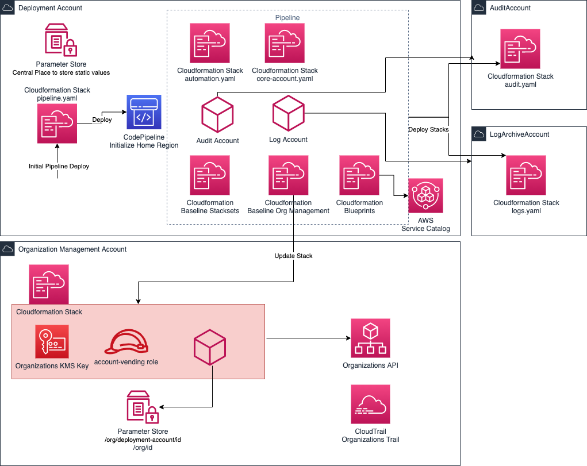

# AWS Enterprise Customer Jumpstart

Enterprise Jumpstart goes beyond multi-account strategy. It gives prescriptive guidance on critical topics part of enterprise cloud foundations.
From our experience cloud foundations can get very complex and there are lots of options going forward.

This repository holds one option to stand up a basic cloud foundation. It covers the following topics:

* Baseline Security via AWS Organizations
  * Service Control Policies
  * Centralized Logging and Monitoring (AWS Config, AWS CloudTrail)
* Automated Account Provisioning via AWS Service Catalog and AWS Organizations
  * Proper Versioning & Staging of multiple Account Blueprints
  * Bulk upgrade of Accounts on Organizational Unit Level

## Tenants - Unless you now better ones

* Security
* Simplicity
* Transparency & Flexibility
* Scalability

## Pre-requisites

* Before starting make sure you run an EC2 instance for at least 30min and then terminate it. This is required to create core accounts.
* In parallel request an service quota increase on AWS Accounts per AWS Organization

## Pre-requisite decisions

* Home region
* Governed regions
* Managed Resource Prefix (default `ent-jumpstart`)
* Email sub-domain, mail addresses for core accounts
* Notification Mail Address

## Jumpstart Deployment Steps

**If not exists applies to all steps**

Use [CHECKLIST.md](CHECKLIST.md) to note down and document required information during the deployment process.

### Perform the following steps within the central organization management account

1. Create AWS Organization and verify the email associated
2. Create `Core`, `Foundation`, `Dev` Organizational Unit
3. Enable Service Control Policies within AWS Organizations
4. Enable Organizations Service Trust on AWS Config and AWS Cloudtrail
   * `aws organizations enable-aws-service-access --service-principal config-multiaccountsetup.amazonaws.com`
   * `aws organizations enable-aws-service-access --service-principal config.amazonaws.com`
   * `aws organizations enable-aws-service-access --service-principal cloudtrail.amazonaws.com`
5. Create dedicated deployment account via AWS organization
6. Move the created deployment account into the Foundation OU
7. Deploy the AWS CloudFormation stack `templates/org-management.yaml` with appropriate parameters, with stack name <ejs-prefix>-base

### Perform the following steps within the newly created deployment account:

1. Create a parameter in AWS Systems Manager Parameter Store for each OU with scheme: `/org/organization-unit/<lowercase-ou-name>`, value: `ou-id` found within AWS Organizations Console
2. Deploy the AWS CloudFormation stack `deployment/pipeline.yaml` with appropriate parameters in the _home_ region
3. Leave Parameter for audit and log account Ids temporary **empty**
4. Walk through all files within `parameter` folder and adapt values (except for strings containing two slash as in orgs)
5. Adopt `scps/metadata.yaml` with correct OU ids
6. Push code to AWS CodeCommit and wait for pipeline succeed
7. Delegate Config Administrator to the Audit Account (to be executed in AWS Organization Account)
   * `aws organizations register-delegated-administrator --account-id 999999999999 --service-principal config-multiaccountsetup.amazonaws.com`
   * `aws organizations register-delegated-administrator --account-id 999999999999 --service-principal config.amazonaws.com`
9. Update the pipeline cloudformation stack with correct audit, log archive account id parameter values
10. Run Automation Pipeline, wait for it being successful
11. Enable AWS CloudTrail Organization Trail in Management Account using bucket created in log archive account and KMS key id found in parameter store
    `aws cloudtrail create-trail --name org-trail --s3-bucket-name cloudtrail-log-archive-<org-id> --kms-key-id <org-kms-key-id> --is-multi-region-trail --include-global-service-events --is-organization-trail --enable-log-file-validation --region <home-region>`
12. Start trail logging: `aws cloudtrail start-logging --name org-trail`

## Jumpstart Big Picture

## Account Vending Usage and Documentation

See blueprints, how-to in [docs/](docs) and https://github.com/aws-samples/aws-organizations-account-resource.

## Security

See [CONTRIBUTING](CONTRIBUTING.md#security-issue-notifications) for more information.

## License

This library is licensed under the MIT-0 License. See the LICENSE file.
