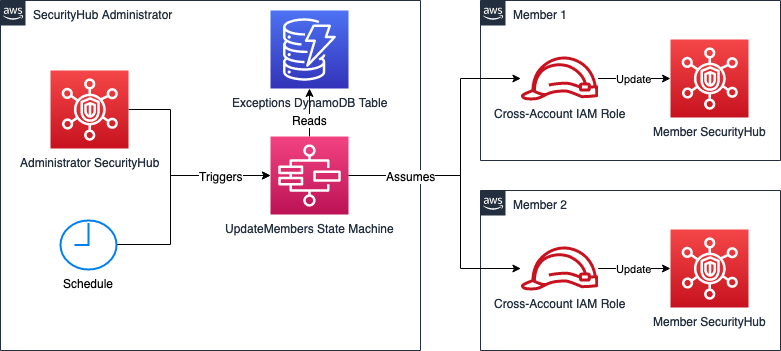
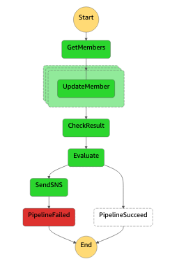

# EJS Hints

`./security-hub` folder is a copy of upstream project [https://github.com/aws-samples/aws-security-hub-cross-account-controls-disabler](https://github.com/aws-samples/aws-security-hub-cross-account-controls-disabler)

# AWS Security Hub Cross-Account Controls Disabler

- [Goal](#goal)
- [Overview](#overview)
- [Setup](#setup)
  - [Requirements](#requirements)
  - [Member Accounts](#member-accounts)
  - [Security Hub administrator account](#security-hub-administrator-account)
- [Usage](#usage)
  - [Setting exceptions](#setting-exceptions)
  - [Security Hub Controls CLI](#security-hub-controls-cli)
- [Workflow and Troubleshooting](#workflow-and-troubleshooting)
- [Customization](#customization)

## Goal

AWS Security Hub allows you to disable controls of security standards such as CIS AWS Foundations controls or AWS Foundational Security Best Practices controls. However, in a multi account setup with a dedicated Security Hub administrator account, there is no native way to disable specific controls globally for all Security Hub member accounts. This project intends to close this gap by propagating the action of enabling or disabling security standards and its controls in the Security Hub administrator account across all of the Security Hub member accounts.

## Overview

The solution consists of the following:
- A **cross-account IAM role** in the member accounts with the requied Security Hub permissions to disable/enable Security standard controls.
- An **AWS Step Function state machine** assuming the cross-account IAM role and disable/enable the controls in the member accounts to reflect the setup in the administrator account.
- An **DynamoDB Table** containing exceptions. The table contains information about which control should be disabled or enabled in which account. This information overrides the configurations fetched from the Security Hub Administrator for the specified acount.



**NOTE:** If you want to update controls across multiple accounts NOT managed by a Security Hub administrator then you can use the script provided in this [blog post](https://aws.amazon.com/blogs/security/disabling-security-hub-controls-in-a-multi-account-environment/). 

## Setup

### Requirements
To deploy this solution, you need
* [AWS CLI version 2](https://docs.aws.amazon.com/cli/latest/userguide/install-cliv2.html)
* [AWS SAM CLI](https://docs.aws.amazon.com/serverless-application-model/latest/developerguide/serverless-sam-cli-install.html)

Also, make sure that one of the AWS accounts is designated as the [Security Hub administrator account](https://docs.aws.amazon.com/securityhub/latest/userguide/securityhub-accounts.html).

### Member Accounts
Deploy the cross-account IAM role defined in [member-iam-role/template.yaml](member-iam-role/template.yaml) in all member accounts.  
For `SecurityHubAdminAccountId`, set the Account ID of the Security Hub administrator account.

#### Deployment

Set an arbitrary `<stack-name>` and the Security Hub administrator account ID for `<AccountId>` and execute following command in a Security Hub member account: 
```
aws cloudformation deploy --template-file member-iam-role/template.yaml --capabilities CAPABILITY_NAMED_IAM --stack-name <stack-name> --parameter-overrides SecurityHubAdminAccountId=<AccountID>
```

For a more efficient deployment to multiple member accounts at once, [AWS CloudFormation StackSets](https://docs.aws.amazon.com/AWSCloudFormation/latest/UserGuide/what-is-cfnstacksets.html) can be used.

#### Parameters
| Name                      | Description                                                                                       | Default                        |
|---------------------------|---------------------------------------------------------------------------------------------------|--------------------------------|
| SecurityHubAdminAccountId | Account ID of SecurityHub administrator Account                   | *None*                           |
| IAMRolePath               | Path for IAM Role - this must match the `MemberIAMRolePath` parameter in the `UpdateMembers` stack. | /                      |
| IAMRoleName               | Name of IAM Role - this must match the `MemberIAMRoleName` parameter in the `UpdateMembers` stack.    | securityhub-UpdateControl-role |

### Security Hub administrator account
Deploy the state machine defined in [UpdateMembers/template.yaml](UpdateMembers/template.yaml)

#### Prerequisites
Since [UpdateMembers/template.yaml](UpdateMembers/template.yaml) is using the [Serverless transformation](https://docs.aws.amazon.com/AWSCloudFormation/latest/UserGuide/transform-aws-serverless.html), you need to have an artifact bucket in the Security Hub administrator account. The following command creates such a bucket with the name `<artifact-bucket>`:
```
aws s3 mb s3://<artifact-bucket>
```

#### Deployment
The artifact bucket created in the preqrequisites is referenced by `<artifact-bucket>` in the code below. Chose an arbitrary `<stack-name>` and execute following commands to deploy the [UpdateMembers/template.yaml](UpdateMembers/template.yaml):
```
sam package --template-file UpdateMembers/template.yaml --output-template-file UpdateMembers/template-out.yaml --s3-bucket <artifact-bucket>
aws cloudformation deploy --template-file UpdateMembers/template-out.yaml --capabilities CAPABILITY_IAM --stack-name <stack-name>
```

#### Parameters
| Name                      | Description                                                                                                  | Default                        |
|---------------------------|--------------------------------------------------------------------------------------------------------------|--------------------------------|
| Schedule |  The scheduling expression that determines when and how often the Security Hub Disabler runs.                             | rate(1 day)                           |
| MemberIAMRolePath         | Path of IAM Role in member account - this must match the `IAMRolePath` parameter in the `memeber-iam-role` stack. | /                      |
| MemberIAMRoleName         | Name of IAM Role in member account - this must match the `IAMRoleName` parameter in the `memeber-iam-role` stack.   | securityhub-UpdateControl-role |
| Path                      | Path of IAM LambdaExecution Roles                                                                            | /                      |
| EventTriggerState                      | The state of the SecurityHubUpdateEvent rule monitoring Security Hub control updates and triggering the state machine                                                                            | DISABLED                      |
| NotificationEmail1                      | Optional - E-mail address to receive notification if the state machine fails.  |                       |
| NotificationEmail2                      | Optional - E-mail address to receive notification if the state machine fails.  |                       |
| NotificationEmail3                      | Optional - E-mail address to receive notification if the state machine fails.  |                       |


## Usage
After deployment, the solution runs automatically based on the following two triggers:
* Scheduled Trigger  
  The timeframe, when the state machine is triggered on a scheduled basis, can be defined by the `Schedule` parameter. The default value is `rate(1 day)`. You can use scheduling expressions as described here: https://docs.aws.amazon.com/eventbridge/latest/userguide/eb-create-rule-schedule.html.  
  The Scheduled Trigger makes sure, that new accounts are updated by this solution after they get added as a Security Hub member account. Also, it propagates the status of the controls which were already disabled before the solutions was deployed to all existing member accounts.
* Event Trigger  
  The state machine is triggered each time a control is disabled/enabled in the Security Hub administrator account. The state of the Event Trigger can be controlled by the `EventTriggerState` parameter during deployment.  
  ***Limitation***: *If a lot of controls are changed in a very short timeframe (e.g. when done programmatically via [Security Hub Controls CLI](https://github.com/aws-samples/aws-security-hub-controls-cli)), the Event Trigger causes multiple parallel executions which may lead to API throttling and thus failure of the execution.*

### Setting exceptions
The DynamoDB table deployed in the SecurityHub administrator account can be filled with exceptions. If an exception is defined for an account, the account will be updated as specified in the exception instead of reflecting the configuration in the SecurityHub Administrator account.

#### Schema
| Field names | ControlId                                                                         | Disabled                                                  | Enabled                                                  | DisabledReason                                                                                                                               |
|-------------|-----------------------------------------------------------------------------------|-----------------------------------------------------------|----------------------------------------------------------|-----------------------------------------------------------------------------------------------------------------------------------------------|
| Description | The ControlId for which an exception should be defined. Primary key of the table. | List of accounts for which the Control should be disabled | List of accounts for which the Control should be enabled | `DisabledReason` to be specified in the `update_standards_control` API call when disabling a control. If omitted, "Exception" is used as default. |
| Type        | String                                                                            | List of Strings                                           | List of Strings                                          | String                                                                                                                                        |
| Example     | `CIS.1.1`                                                                         | `[ { "S" : "111111111111" } ]`                            | `[ { "S" : "222222222222" }  ]`                          | `Some_Reason`                                                                                                                                 |
#### Update DynamoDB table
To create an exception, an item in the DynamoDB table needs to be created. The following JSON object creates an exception for control `CIS.1.1`:
```
{
 "ControlId": {
  "S": "CIS.1.1"
 },
 "Disabled": {
  "L": [
   {
    "S": "11111111111"
   }
  ]
 },
 "Enabled": {
  "L": [
   {
    "S": "22222222222"
   }
  ]
 },
 "DisabledReasod": {
  "S": "Some_Reason"
 }
}
```

This JSON object can either be put via the AWS Console or via the AWS CLI. The following AWS CLI command creates an item in the DynamoDB table `<DynamoDB-table-name>`:
```
aws dynamodb put-item --table-name <DynamoDB-table-name> --item '{ "ControlId": { "S": "CIS.1.1" }, "Disabled": { "L": [ { "S": "11111111111" } ] }, "Enabled": { "L": [ { "S": "22222222222" } ] }, "DisabledReasod": { "S": "Some_Reason" } } '
```
The DynamoDB table name can be found in the Outputs section of the CloudFormation stack in the SecurityHub administrator account under the name `AccountExceptionsDynamoDBTableName`. It can also be retrieved with the following AWS CLI command:
```
aws cloudformation describe-stacks --query "Stacks[].Outputs[?OutputKey=='AccountExceptionsDynamoDBTableName'].OutputValue" --output text
```

#### Example
In this section, the evaluation logic is explained using the following example: 

* CIS.1.1 will be disabled for account `11111111111`, overriding the information fetched from the SecurityHub administrator. No exceptions are defined to enable this control. `Some_Reason` will be specified in the `update_standards_control` API call when disabling this control for account `11111111111`.
* CIS.1.2 will be enabled for account `11111111111`, overriding the information fetched from the SecurityHub administrator. No exceptions are defined to disable this control.
* CIS.1.3 will be enabled for account `22222222222`, overriding the information fetched from the SecurityHub administrator. No exceptions are defined to disable this control. The empty entry in `Disabled` has the same effect as an empty list (`[]`).
* CIS.1.4 will be disabled for account `22222222222`, overriding the information fetched from the SecurityHub administrator. No exceptions are defined to enabled this control. `Exception` will be specified in the `update_standards_control` API call when disabling this control for account `22222222222`, since no explicit `DisabledReason` was given.
* CIS.1.5 specifies the same account in both, `Disabled` and `Enabled` list. This is a conflict and the exception will be ignored. A warning will be logged in the `UpdateMembers` Lambda function and the control for the account `22222222222` will be set as specified in the SecurityHub administrator as a fallback.
* Any other account and control will be set as specified in the SecurityHub administrator.

### Security Hub Controls CLI
[Security Hub Controls CLI](https://github.com/aws-samples/aws-security-hub-controls-cli) is a CLI tool to disable and enable security standards controls in AWS Security Hub. It also supports the exception handling described [here](#setting-exceptions).

## Workflow and Troubleshooting

Since the solution is implemented via AWS Step Functions state machine, each execution can be inspected in the AWS Step Functions state machine dashboard.

A **successfull** execution can be seen in the following picture:  


A **failed** execution can be seen in the following picture:  


An execution can fail, for example, if the cross-acccount IAM Role is not deployed in the member account or any other `ClientError` is raised in the `UpdateMember` Lambda function.

In that case, a message is published to the SNS topic in the `SendSNS` step, containing information about which accounts were not updated successfully and providing the according error message per account. E-Mail addresses receiving the message can be set during deployment via the `NotificationEmail*` parameters.  
The same information can be inspected in the the state machine logs. You find this information for example in the *Step Input* section of the *PipelineFailed* step as seen in the following picture:  


## Customization

It may be desired to change or add other subscription types into the SNS topic. The sections to be changed for that are marked with `# TODO - Subscriptions` in the [UpdateMembers/template.yaml](UpdateMembers/template.yaml) file.

